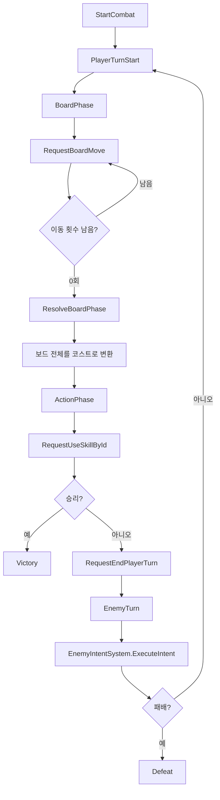

# Project 2048 전투 코드 쉬운 설명서

이 문서는 `Project 2048`의 전투 프로토타입을 처음 보는 사람이 흐름을 따라갈 수 있게 정리한 설명서다.

UI 클릭음은 이 작업의 담당 범위가 아니다. 전투 피드백 사운드는 버튼 자체가 아니라 전투 이벤트와 ScriptableObject 효과 데이터에서 재생되도록 분리되어 있다.

파일 하나하나가 무슨 역할인지 보려면 `Docs/CodeFileReference.md`를 보면 된다.

핵심은 화면 모양이 아니라 아래 네 가지다.

- 2048 보드를 움직여 행동 코스트를 만든다.
- 만든 코스트로 공격 또는 방어 스킬을 쓴다.
- 적은 다음 행동을 미리 보여주고, 적 턴에 그 행동을 실행한다.
- UI나 테스트는 전투 내부 객체를 직접 만지지 않고 `CombatSnapshot`과 command 메서드만 쓴다.
- 디버프가 발동하면 `CombatSnapshot.LastVfxCue`로 임시 VFX 신호를 보낸다.
- 전투 승패, 보상 선택, 스킬 사용, 몬스터 등장, 보드 이동/병합 사운드는 SO 효과 데이터나 전투 이벤트를 통해 재생한다.

## 가장 짧은 요약

플레이어 턴은 이렇게 돈다.

```text
2048 보드 조작
-> 이동 횟수 0
-> 보드 숫자 전체를 코스트로 변환
-> 공격/방어 스킬 사용
-> 턴 종료
-> 적 인텐트 실행
-> 다음 플레이어 턴
```

외부 UI가 알아야 할 전투 연결점은 이것만 보면 된다.

```csharp
combatManager.GetSnapshot();
combatManager.OnCombatStateChanged += RenderFromSnapshot;

combatManager.RequestBoardMove(direction);
combatManager.RequestUseSkillById(skillId, targetIndex);
combatManager.RequestEndPlayerTurn();
```

## 어디부터 읽으면 되나

처음 볼 때는 이 순서가 가장 덜 헷갈린다.

1. `Assets/Scripts/Combat/CombatManager.cs`
2. `Assets/Scripts/Combat/CombatSnapshot.cs`
3. `Assets/Scripts/Board2048/Board2048Manager.cs`
4. `Assets/Scripts/Board2048/CostConverter.cs`
5. `Assets/Scripts/Skills/SkillExecutor.cs`
6. `Assets/Scripts/Enemy/EnemyIntentSystem.cs`
7. `Assets/Scripts/Enemy/EnemyAiBrain.cs`
8. `Assets/Scripts/Presentation/CombatEffectBinding.cs`
9. `Assets/Scripts/Prototype/CombatUiView.cs`

`Prototype` 폴더는 확인용 UI와 프로토타입 presentation 레이어다. UI 버튼 사운드는 여기서 담당하지 않고, 전투 피드백 사운드는 SO 데이터와 전투 이벤트를 읽어 재생한다.

## 폴더 역할

```text
Assets/Scripts/Combat
  전투 흐름, 플레이어 상태, 전투 결과, 외부 UI용 snapshot

Assets/Scripts/Board2048
  2048 보드 이동, 병합, 방해 블록, 보드->코스트 변환

Assets/Scripts/Cost
  현재 행동 코스트 보유량과 소비 처리

Assets/Scripts/Enemy
  적 상태, 적 인텐트, 적 AI 브레인, 적 디버프

Assets/Scripts/Skills
  공격/방어 스킬 데이터와 실행

Assets/Scripts/Presentation
  전투/보드 효과 바인딩, actionId, 사운드/VFX 공용 재생 데이터

Assets/Scripts/Prototype
  임시 플레이 확인용 UI, 전투 presentation 사운드 재생, 기본 데이터 생성

Assets/Editor
  임시 UI를 씬에 만들어 주는 에디터 메뉴

Assets/Tests/EditMode
  전투 규칙과 UI 연결 계약을 검증하는 테스트

Docs/CodeFileReference.md
  모든 C# 파일별 역할, 연결, 주의점 정리
```

## 핵심 용어

`CombatManager`
: 전투의 메인 관리자다. 전투 시작, 턴 전환, 보드 종료, 스킬 사용, 적 턴, 승패 판정을 묶어서 처리한다.

`CombatSnapshot`
: UI가 읽는 전투 상태다. 현재 phase, 코스트, 보드, 플레이어 HP, 적 HP, 적 인텐트, 스킬 목록, 마지막 VFX 신호가 들어 있다.

`Command`
: UI가 전투에 요청하는 입력이다. 예를 들면 `RequestBoardMove`, `RequestUseSkillById`, `RequestEndPlayerTurn`이다.

`Board2048Manager`
: 2048 보드만 담당한다. UI 타일 오브젝트를 직접 움직이지 않는다.

`CostConverter`
: 보드에 남은 모든 숫자를 행동 코스트로 바꾼다.

`EnemyIntent`
: 적이 다음 적 턴에 할 행동이다. 공격, 방어, 디버프가 있다.

`Enemy AI 타입`
: 적의 공격/방어 성향, 디버프 순서, 일반/강화 여부를 합친 표시다. 예를 들면 `AI: 공격 몰빵 / 공포->암흑 / 강화`다.

## CombatManager가 하는 일

파일: `Assets/Scripts/Combat/CombatManager.cs`

이 클래스는 전투의 중심이다.

주요 public 메서드는 다음과 같다.

```csharp
StartCombat(CombatSetup setup)
GetSnapshot()
RequestBoardMove(Direction direction)
RequestUseSkill(SkillSO skill, EnemyController target)
RequestUseSkillById(string skillId, int targetIndex)
RequestEndPlayerTurn()
```

중요한 점은 UI가 `PlayerCombatController`, `EnemyController`, `Board2048Manager`를 직접 조작하지 않아도 된다는 것이다. UI는 `GetSnapshot()`으로 상태를 읽고, command 메서드로 입력만 넘기면 된다.

전투 상태가 바뀌면 이 이벤트가 발생한다.

```csharp
public event Action<CombatSnapshot> OnCombatStateChanged;
public event Action<CombatResult> OnCombatVictory;
public event Action OnCombatDefeat;
public event Action<SkillSO, EnemyController> OnPlayerSkillUsed;
```

정식 UI는 `OnCombatStateChanged`를 받아 화면을 다시 그리면 된다. 전투 결과음과 스킬 사용음은 UI 버튼이 아니라 `OnCombatVictory`, `OnCombatDefeat`, `OnPlayerSkillUsed` 같은 전투 이벤트를 구독해서 재생한다.

## 한 턴의 실제 흐름



## 2048 보드 규칙

파일: `Assets/Scripts/Board2048/Board2048Manager.cs`

보드는 4x4 `int[,]`다.

- `0`: 빈 칸
- `2`, `4`, `8` 등: 일반 2048 숫자 타일
- `-1`: 암흑 디버프로 생기는 방해 블록

중요한 규칙은 다음과 같다.

- 막힌 방향으로 입력하면 이동 횟수를 쓰지 않는다.
- 한 번의 이동에서 같은 타일이 두 번 합쳐지지 않는다.
- 방해 블록은 벽처럼 동작한다.
- 이동이 성공하면 새 타일 하나가 생긴다.
- 이동 횟수가 0이 되면 `OnBoardFinished`가 발생하고 전투가 ActionPhase로 넘어간다.

좌표는 코드에서 두 방식이 같이 나온다.

- 보드 배열: `board[row, col]`
- 이동/애니메이션 위치: `Vector2Int(x: col, y: row)`

둘은 서로 다른 칸을 뜻하는 것이 아니다. 같은 칸을 배열 방식과 화면 좌표 방식으로 다르게 적는 것이다.

`row`는 행이다. 위에서 아래로 몇 번째 줄인지를 뜻한다. `col`은 열이다. 왼쪽에서 오른쪽으로 몇 번째 칸인지를 뜻한다. C# 2차원 배열은 보통 `board[row, col]`처럼 행을 먼저 쓰기 때문에 세로 위치가 앞에 온다.

반대로 `Vector2Int`는 좌표라서 `x`가 가로, `y`가 세로다. 그래서 같은 칸을 좌표로 넘길 때는 `Vector2Int(x: col, y: row)`처럼 바꿔서 넣는다.

예를 들어 `board[2, 1]`은 2번째 행, 1번째 열이다. 화면 좌표로는 `x = 1`, `y = 2`가 된다.

이 차이 때문에 보드 코드를 고칠 때는 row와 col을 섞지 않도록 조심해야 한다.

## 코스트 계산

파일: `Assets/Scripts/Board2048/CostConverter.cs`

코스트는 보드에서 가장 큰 숫자 하나만 보는 것이 아니다. 보드에 남은 모든 숫자를 각각 코스트로 바꾼 뒤 합산한다.

현재 변환표는 테스트와 전투 루프 검증을 위한 임시 수치다. 정식 밸런스가 정해지면 이 표는 바뀔 수 있다.

| 타일 | 코스트 |
|---:|---:|
| 2 | 1 |
| 4 | 2 |
| 8 | 3 |
| 16 | 5 |
| 32 | 8 |
| 64 | 13 |
| 128 | 21 |
| 256 | 34 |
| 512 | 55 |
| 1024 | 89 |
| 2048 | 144 |

빈 칸, 방해 블록, 표에 없는 값은 코스트 0이다.

## 스킬 규칙

파일: `Assets/Scripts/Skills/SkillExecutor.cs`

스킬은 `SkillSO` 데이터로 정의한다.

공격 스킬:

- 플레이어 공격력 + 스킬 위력만큼 적에게 피해를 준다.
- `targetAttackModifier`가 있으면 적 공격력을 낮추거나 올린다.

방어 스킬:

- 스킬 위력 + 현재 방어 보너스만큼 플레이어 방어도를 얻는다.
- `selfDefenseBonus`가 있으면 이후 방어 스킬의 획득량이 바뀐다.

스킬 사용 순서는 다음과 같다.

```text
UI 버튼
-> RequestUseSkillById(skillId, targetIndex)
-> 스킬 찾기
-> 코스트 확인
-> 코스트 소비
-> OnPlayerSkillUsed 이벤트
-> SkillExecutor.Execute
-> snapshot 갱신
```

## 적 인텐트와 디버프

파일: `Assets/Scripts/Enemy/EnemyIntentSystem.cs`

적은 다음 행동을 미리 보여준다. 이 값이 `EnemyController.CurrentIntent`다.

인텐트 종류는 다음과 같다.

| 타입 | 의미 |
|---|---|
| Attack | 플레이어에게 피해 |
| Defense | 적이 방어도 획득 |
| Debuff | 플레이어 또는 보드에 방해 효과 |

현재 디버프는 두 가지다.

| 디버프 | 효과 |
|---|---|
| Fear | 플레이어가 이번 턴에 얻는 방어도 획득량 6 감소 |
| Darkness | 다음 보드에 이동 불가능한 방해 블록 설치 |

공포는 `PlayerCombatController.FearStacks`에 고정 페널티 `6`을 저장한다. 그래서 이번 플레이어 턴 동안 방어 스킬을 쓸 때 최종 방어 획득량은 `스킬 방어량 + DefenseBonus - 6`으로 계산된다. 최종 획득 방어도는 0 아래로 내려가지 않고, 플레이어가 턴을 넘기면 공포는 해제된다.

암흑은 `Board2048Manager.QueueObstacles`로 방해 블록을 예약한다. 적 턴이 끝나고 다음 플레이어 보드가 시작될 때 `-1` 값의 방해 블록이 보드 안에 배치된다. 이 블록은 숫자 타일처럼 움직이거나 합쳐지지 않고, 2048 이동에서 벽처럼 동작한다.

디버프가 실제로 실행되면 `CombatManager`가 `CombatVfxCue`를 만든다. 정식 UI는 `snapshot.LastVfxCue.Sequence`가 이전에 본 값보다 커졌을 때 한 번만 VFX를 틀면 된다.

현재 프로토타입 UI의 디버프 VFX는 확인용 임시 구현이다.

| 디버프 | 임시 VFX |
|---|---|
| Fear | 붉은 화면 오버레이, "공포: 방어도 획득 -6" 문구, 플레이어 초상화 짧은 펄스 |
| Darkness | 보라색 화면 오버레이, "암흑: 방해 블록 +N" 문구, 방해 블록 셀 펄스 |

적 데이터에 `intentPattern`이 있으면 그 순서대로 반복한다. 이 방식은 보스처럼 정확한 순서를 가져야 하는 적에게 쓴다.

`intentPattern`이 비어 있으면 `EnemyAiBrain`이 다음 행동을 만든다. AI 브레인은 세 가지 값을 본다.

| 설정 | 의미 |
|---|---|
| `aiActionBias` | 공격/방어 중 어느 쪽을 더 자주 고를지 정한다 |
| `aiDebuffPattern` | 디버프 턴에 공포와 암흑을 어떤 순서로 낼지 정한다 |
| `aiStrength` | 일반형과 강화형을 구분하고 생성된 인텐트 수치를 조정한다 |

공격 몰빵 적은 공격 가중치가 높고, 방어 몰빵 적은 방어 가중치가 높다. 밸런스 적은 공격과 방어를 비슷하게 고른다. 디버프는 `aiDebuffInterval`마다 끼워 넣는다.

현재 프로토타입 전투는 같은 적만 계속 나오지 않도록 전투 시작마다 임시 적 AI 풀에서 하나를 랜덤으로 뽑는다. 이 풀은 12개 임시 적으로 구성한다.

- 일반형 8개
- 강화형 4개
- 공격 몰빵, 방어 몰빵, 밸런스 성향 포함
- 공포->암흑, 암흑->공포 디버프 순서 포함

적 머리 위에는 현재 뽑힌 적의 AI 타입을 표시한다.
전용 적 HP 텍스트가 있는 임시 UI에서는 `체력 현재/최대 / 방어 N`으로 표시하고, 오래된 임시 씬처럼 전용 적 HP 텍스트가 없으면 적 머리 위 라벨에 체력과 방어도를 같이 표시한다.

정리하면 현재 적 행동 결정 순서는 이렇다.

```text
intentPattern이 있음
-> 고정 패턴 사용

intentPattern이 비어 있음
-> aiDebuffInterval 턴이면 디버프 선택
-> 아니면 aiActionBias 가중치로 공격/방어 선택
-> aiStrength가 Enhanced면 생성된 수치를 1.5배로 보정
```

## 프로토타입 UI의 역할

파일: `Assets/Scripts/Prototype/CombatUiView.cs`

이 UI는 담당 범위의 정식 UI가 아니다. 전투 루프를 눈으로 확인하기 위해 임시로 이런 식으로 구현한 화면이다.

임시 UI도 전투 코어와 연결할 때는 아래 구조만 쓴다.

- `OnCombatStateChanged`를 구독한다.
- 받은 `CombatSnapshot`을 보고 화면을 갱신한다.
- 보드 입력은 `RequestBoardMove`로 보낸다.
- 스킬 버튼은 `RequestUseSkillById`로 보낸다.
- 턴 종료 버튼은 `RequestEndPlayerTurn`으로 보낸다.
- HP 디버프 아이콘 위치는 `BattleScene`의 `PlayerBattleStatusEffects`, `PlayerBoardStatusEffects`, `EnemyStatusEffects` RectTransform에서 조절한다. 전투 하단 플레이어 HP는 `HpBarBg` 아래의 `PlayerBoardStatusEffects`와 `BlockIcon`을 쓴다.

정식 UI를 새로 만들 때도 전투 코어와의 연결 방식은 이것을 유지하면 된다.

## 프로토타입 전투 사운드 구현

파일:

- `Assets/Scripts/Presentation/CombatEffectBinding.cs`
- `Assets/Scripts/Presentation/CombatantActionEffectBinding.cs`
- `Assets/Scripts/Presentation/CombatActionIds.cs`
- `Assets/Scripts/Presentation/BoardTileEffectProfileSO.cs`
- `Assets/Scripts/Prototype/PrototypeCombatAudioRouter.cs`
- `Assets/Scripts/Prototype/PrototypeCombatEventAudioPlayer.cs`
- `Assets/Scripts/Prototype/PrototypeCombatEventAudioProfileSO.cs`
- `Assets/Scripts/Prototype/CombatWorldSpriteView.cs`
- `Assets/Scripts/Prototype/CombatUiView.cs`

현재 사운드는 UI 버튼 클릭음이 아니라 전투 결과, 보상 선택 결과, 스킬 사용, 몬스터 등장, 보드 이동/병합 같은 gameplay/presentation 이벤트에 붙어 있다.

전투 코어에 `AudioSource`나 `AudioClip`을 넣지 않는다. `CombatManager`는 이벤트만 내고, 실제 클립 선택은 SO가 담당한다.

```text
CombatManager.OnCombatVictory / OnCombatDefeat
-> PrototypeCombatEventAudioPlayer
-> PrototypeCombatEventAudioProfileSO
-> CombatEffectBinding.sfxClip

RewardManager.OnRewardClaimed
-> PrototypeCombatEventAudioPlayer
-> PrototypeCombatEventAudioProfileSO
-> CombatEffectBinding.sfxClip

CombatManager.OnPlayerSkillUsed
-> CombatWorldSpriteView
-> SkillSO.activationEffect

몬스터 등장
-> 로딩 UI 종료
-> BattleSceneBinder가 FlowController.OnGameStarted 발생
-> PrototypeCombatBootstrap이 전투 시작
-> CombatWorldSpriteView
-> 오른쪽 진입 점프 인트로
-> EnemySO.actionEffects[actionId = "appear"]

BoardTransition
-> PrototypeCombatAudioRouter
-> BoardTileEffectProfileSO.moveEffect / mergeEffects[tileValue]
-> CombatUiView가 effect를 재생
```

보드 병합은 `defaultMergeEffect` fallback을 쓰지 않는다. 현재 지원하는 타일 값은 `PrototypeBoardTileEffects.asset`의 `mergeEffects`에 모두 명시해야 한다.

몬스터 등장 사운드는 로딩 중에 재생하지 않는다. `BattleSceneBinder`가 `LoadingUI.IsVisible`이 꺼질 때까지 기다린 뒤 `FlowController.CompleteBattleSceneLoad()`를 호출하고, `PrototypeCombatBootstrap`은 `FlowController.OnGameStarted`를 받은 뒤 전투를 시작한다. 그 다음 `CombatWorldSpriteView`가 적 스프라이트를 화면 오른쪽에서 점프하듯 들어오게 한 뒤 `EnemySO.actionEffects`의 `appear` effect를 재생한다.

| 사운드 | 데이터 위치 |
|---|---|
| 전투 승리/패배 | `PrototypeCombatEventAudioProfileSO` |
| 보상 휴식/강화 선택 | `PrototypeCombatEventAudioProfileSO` |
| 스킬 사용 | `SkillSO.activationEffect` |
| 몬스터 등장 | `EnemySO.actionEffects`의 `appear` |
| 보드 이동/병합 | `BoardTileEffectProfileSO` |

`CombatUiView`에는 더 이상 `playerHitClip`, `enemyHitClip`, `boardMoveClip`, `boardMergeClip` 같은 UI 소유 인스펙터 클립을 두지 않는다. 보드 효과는 `BoardTileEffectProfileSO`의 `CombatEffectBinding`만 읽는다.

`AudioSource`는 UI 피드백용으로 2D에 가깝게 맞춰 둔다.

- `spatialBlend = 0`
- `playOnAwake = false`
- `mute = false`
- `volume = 1`
- `soundVolumeScale = 3` 기본값

`soundVolumeScale`은 보드 effect 재생 배율이다. 전투 결과/보상/스킬/몬스터 등장 사운드는 각 SO의 `CombatEffectBinding.volumeScale`, `minPitch`, `maxPitch`에서 조정한다.

## 자주 바꿀 가능성이 큰 값

| 바꾸고 싶은 것 | 위치 |
|---|---|
| 타일별 코스트 | `CostConverter.cs` |
| 기본 보드 이동 횟수 | `PrototypeCombatBootstrap.boardMoveCount` 또는 `CombatSetup.boardMoveCount` |
| 플레이어 HP/공격력 | `PlayerSO` |
| 적 HP/공격력/패턴 | `EnemySO` |
| 스킬 코스트/위력 | `SkillSO` |
| 스킬 사용 사운드 | `SkillSO.activationEffect` |
| 몬스터 등장 사운드 | `EnemySO.actionEffects`의 `appear` |
| 몬스터 등장 연출 시간 | `CombatWorldSpriteView.EnemyAppearIntroDurationSeconds` |
| 전투 승패/보상 선택 사운드 | `PrototypeCombatEventAudioProfile.asset` |
| 보드 이동/병합 사운드 | `PrototypeBoardTileEffects.asset` |
| 적 턴 대기 시간 | `CombatManager.EnemyTurnDelaySeconds` |
| 타일 이동 애니메이션 속도 | `CombatUiView.BoardTransitionDurationSeconds` |
| 보드 종료 후 액션 패널 전환 지연 | `CombatUiView.BoardToActionPanelDelaySeconds` |

## 건드릴 때 주의할 경계

`CombatManager`에는 화면 배치, 버튼 색, 사운드, 저장 로직을 넣지 않는다.

`Board2048Manager`에는 Unity UI 오브젝트 이동 코드를 넣지 않는다.

정식 UI는 `CombatSnapshot`을 읽고 command를 호출하는 역할만 맡는다.

정식 사운드도 전투 코어를 직접 오염시키지 않는다. 필요하면 `BoardTransition`, 전투 이벤트, 또는 SO의 `CombatEffectBinding`을 읽어서 재생한다.

스킬 수치와 캐릭터 수치는 가능하면 `ScriptableObject` 데이터에서 조정하고, 전투 규칙 자체를 바꿔야 할 때만 C# 코드를 수정한다.

## 테스트가 확인하는 것

파일 위치: `Assets/Tests/EditMode`

주요 테스트 범위는 다음과 같다.

| 테스트 파일 | 확인 내용 |
|---|---|
| `Board2048ManagerTests.cs` | 2048 이동, 병합, 이동 횟수 |
| `Board2048TransitionTests.cs` | 타일 이동/병합 애니메이션용 데이터 |
| `CostConverterTests.cs` | 보드 전체 숫자 코스트 합산 |
| `ActionCostWalletTests.cs` | 코스트 보유/소비 |
| `CombatManagerTests.cs` | 전투 phase, 승패, 스킬 사용 |
| `CombatUiContractTests.cs` | UI가 snapshot과 command만으로 전투를 조작할 수 있는지 |
| `EnemyAiBrainTests.cs` | 고정 패턴 우선, AI 공격/방어 가중치, 디버프 순서, 강화형 수치 |
| `EnemyDebuffTests.cs` | 공포/암흑 디버프 실제 효과 |
| `CombatUiViewTests.cs` | 프로토타입 UI 상수, 입력 기준, 임시 VFX 시간, 보드 effect 프로필 연결 |
| `CombatPresentationEffectTests.cs` | 전투 이벤트 사운드, SO effect 바인딩, 몬스터 등장/스킬/보드 효과 |
| `PrototypeCombatUiStateTests.cs` | phase별 UI 패널 전환 |

정확한 EditMode 테스트 개수와 통과 여부는 Unity Test Runner의 현재 결과를 기준으로 확인한다.

## Unity에서 검증하는 방법

Unity Editor에서 확인할 때는 다음 순서가 가장 안전하다.

1. Console에 C# compile error가 없는지 본다.
2. Test Runner를 연다.
3. EditMode 전체 테스트를 실행한다.
4. 결과가 `0 failed`인지 확인한다.

Codex MCP로 검증할 때는 `run_tests(mode: "EditMode")`를 실행하고 `get_test_job`으로 결과를 확인하면 된다.

## 다음 작업자가 지켜야 할 기준

전투 코어를 고칠 때는 먼저 테스트를 추가하거나 기존 테스트를 확인한다.

UI를 고칠 때는 전투 코어 내부 필드를 직접 참조하지 말고 `CombatSnapshot`과 command 메서드를 쓴다.

보드 규칙을 고칠 때는 이동 횟수 소비, 방해 블록, 한 번 이동 안의 중복 병합 금지를 같이 확인한다.

적 인텐트를 고칠 때는 "미리 보여주는 값"과 "실제로 실행되는 값"이 어긋나지 않아야 한다.
